### 8 Days before, The Days Leading Up to SF 6/10
{hole}
## Almost There!

I’m typing this while racing to hit 100 hours of work on my website project-only 20 minutes to go! Once I cross that finish line, I’ll have exactly 16 days until my big trip to San Francisco.

## What Happened Today
When the trains went on strike today, everyone switched to online classes. Normally we’d get the day off, but apparently we’ve been too “rested” lately. So here I am-Zooming away, coffee in hand, multitasking like a champ while jotting down these notes.

### Day 1
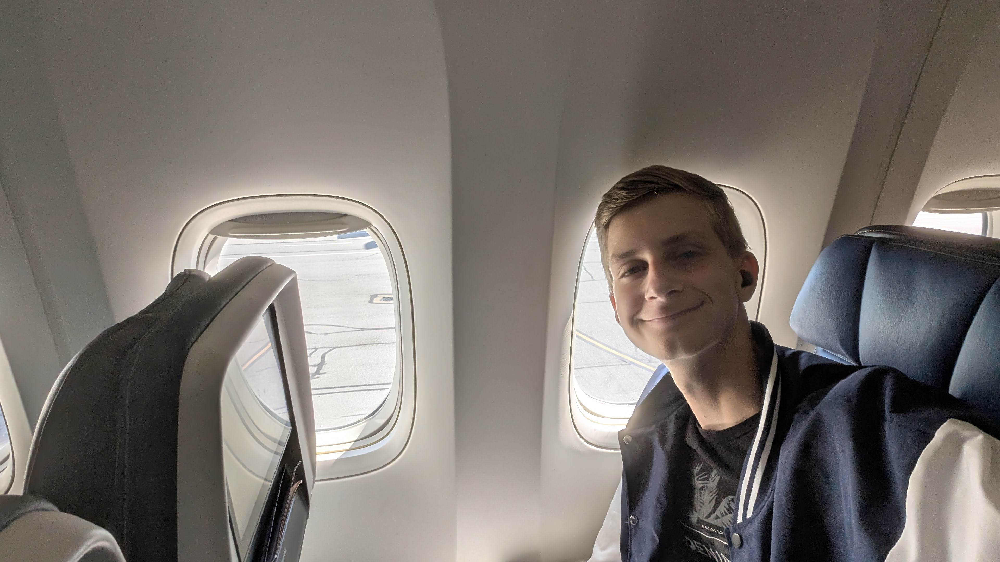{left}
## Before the flight
I arrived at Schiphol with my brother, mom, and dad. After a few hugs and a very real “this is it” moment at the gate, I waved goodbye and stepped into solo travel mode. Next stop: San Francisco. Alone. For real.

## My Flight,
The flight itself? Surprisingly chill. I somehow scored three seats to myself. I stretched out (kinda), watched Interstellar for the 2nd time, and vibed to music until sleep finally kicked in. Sure, it wasn’t five-star comfort, but it did the job.

## I arived!
Touchdown in San Francisco! But of course, my story couldn’t be that smooth, border control wasn’t quite sure what to make of my “I’m going to build stuff with internet nerds I met online” explanation. So they took me into a separate room for an “interview.”

After explaining Hack Club, convincing them I’m not a threat to national security, and answering a few curious questions, they gave me the green light.

I took the BART (Bay Area metro) into the city, and then walked nearly 3 miles uphill with my backpack and suitcase. Welcome to San Francisco: the city of tech dreams.

## Pizza party
When I finally got to the house, Paolo and my roommates were already heading out, to a pizza-making party at the other Hack Club house. Even though I felt like a zombie, I tagged along. We made pizzas until 11pm, and by then my body had given up on being alive.

## Attempting Sleep
Everyone else had their bed setups ready with pillows and cozy blankets. Me? I had a couch pillow from the other house and a thin airplane blanket. It was freezing in the house. I barely slept. So yeah. end of Day 0, and I’m basically running on nothing.

### Day 2
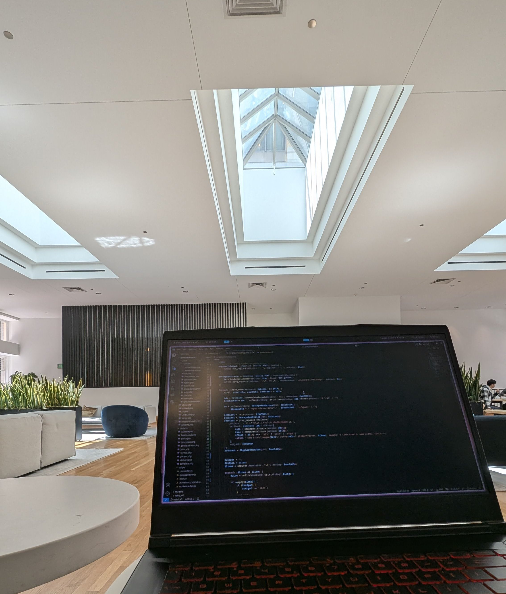{right}
## Morning After the Storm
After that awful night of tossing and turning, I gave up trying to sleep by 6am. My body thought it was 3pm anyway. I got up, hit the toilet, and had a chill early-morning chat with one of my roommates. I ate an apple, walked to a local café, and called my mom.

I told her the truth:
“This isn’t really what I expected... I’m not sure I want to stay the full time.”
Big feelings, right from the start.

## Chat With Paolo
Later, Paolo (a organizer and housemate) sat down with me to chat about what I wanted to build here while im at San fransico.
Truth be told, I had no clue. I thought it’d be like Juice in Shanghai, but this time, there was too much freedom. No structure. No guide rails. Just… “do your thing.”
It hit me: I’ve never really lived independently, let alone worked in a self-directed way from 9 to 5. It was overwhelming, and I started questioning whether I’d made the right choice.

## 12PM & Some Normalcy
After sulking in bed for way too long, Paolo and Abby suggested we head to the Hack Club open space. a big, cozy area where everyone was coding, vibing, and doing their thing.
We grabbed lunch on the way, and honestly, I finally started to feel a little bit like myself again.

But the peace didn’t last long. 
Paolo dipped early with a headache, and Abby went out for food… and just *never came back.* So now I was alone, surrounded by laptops and strangers, wondering what to do next.

Cue: spontaneous side quest.

## The Random Adventure
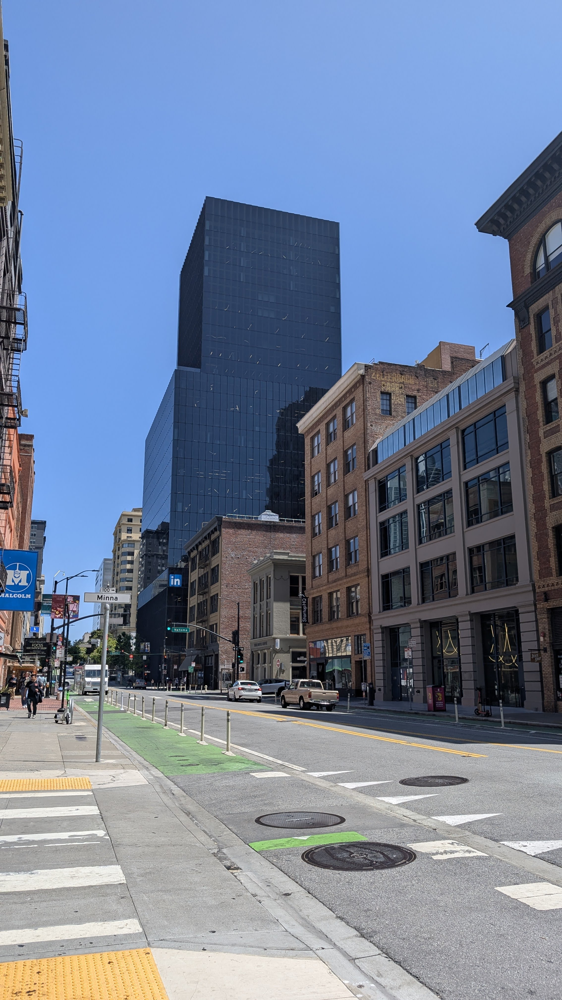{right vertical}
Feeling restless, I called my brother just to check in, and my dad jumped on the call too. With my family on the line and no destination in mind, I just started walking. somewhere. Anywhere.

That “anywhere” turned out to be… **LinkedIn HQ.**
Yup. Just stumbled right into the corporate heart of networking itself.

There was a big public lounge space inside. suits and startup folks having Very Important Conversations™. And me? I walked up to the front desk like,
“Hey, got any stickers?”
A few minutes later, I walked out with some LinkedIn swag: stickers and a branded keychain lanyard. Mission accomplished.

## The Great Pillow Rescue
After wrapping up the call, I realized I had unfinished business: **Sleep.**
Last night’s setup, rock-hard couch pillow and a too-small airplane blanket. wasn’t going to cut it again.

So I went on a heroic quest to Target, hunting for something softer, warmer, and just… not awful.
It wasn’t exactly a luxury hotel haul, but it was a major upgrade. Mission: *mostly* successful.

## Grocery Chaos
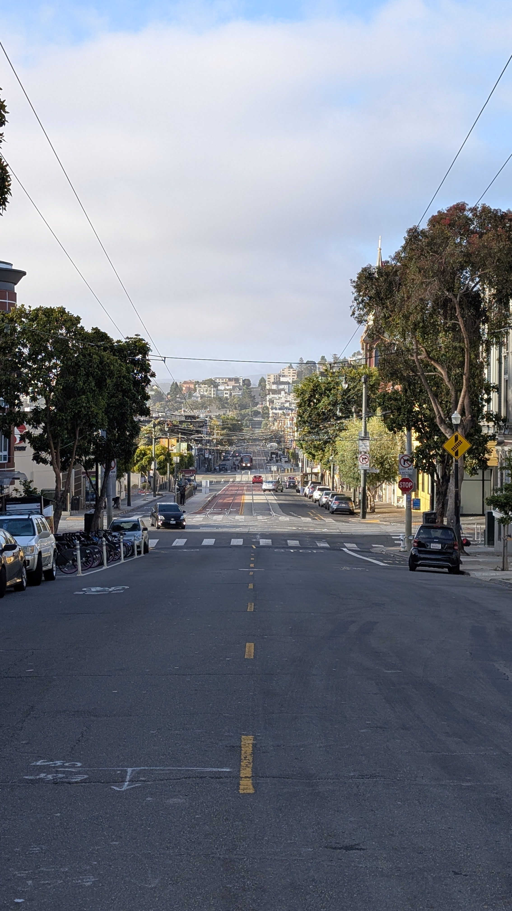{left horizantal}
Later in the day, the five of us decided to stock up on breakfast and other essentials. Easy, right?
Turns out, not so much. With five people from different cultures, everyone had totally different ideas of what to buy. After aimlessly wandering for ten minutes, we finally made a list and split up.

My task? Apples and bananas. And. no joke. we were standing right next to the fruit section.
Mission complete in under 10 seconds.

By the time we got home it was nearly 7pm, and I was starving. But I was so exhausted I just went to bed instead. Food could wait. sleep couldn’t

## Midnight Dinner
I woke up around 11pm, still tired but now super hungry. I made a PB&J sandwich. nothing fancy, just bread, peanut butter, and jelly.
That was dinner. Simple, but it did the trick.

Right as I finished, new roommates showed up. We're now 7 people in the house. It’s getting cozy!

### Day 3 Feeling Better
{hole}

## Morning Reset
Woke up at 6am again. jet lag still doing its thing. I didn’t want to wake anyone, so I grabbed some fruit and went for a quiet walk.

I called home and said something important:
**"I'm feeling way better today."**

Yesterday was rough, but I realized I can’t wait for things to be fun. I have to make them fun.
Paolo mentioned that attending events could count as programming time if we show proof. 2 hours per event. That sounded perfect. I was in.

## Target Trip, Part II
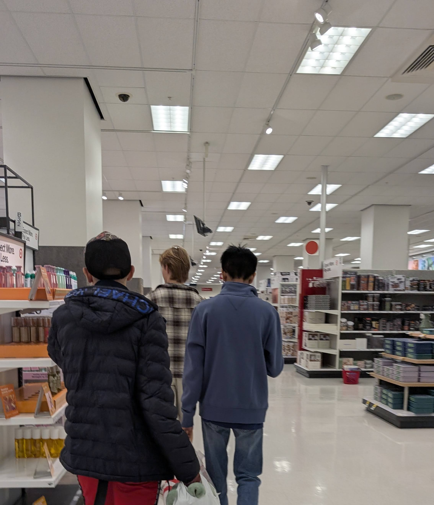{right horizantal}
Realized I still didn’t have a towel. So, back to Target! This time with four of us, picking up towels, dish soap, plates. everything we forgot the first time.

After a much-needed shower, I wrote down yesterday’s and today’s notes. Then we went to the Hack Club workspace downtown, where I worked on my own operating system. **NickOS**. and finally got it running on my laptop.

## Thomas’s Curry Night
On my way back home, I got a DM:

> "Thomas is cooking dinner for everyone at 7pm at Lower Haight."

By the time I arrived, Thomas, Paolo, and Nick A, were cooking curry for **20 people**.
Smoke alarms went off (a lot), but people kept showing up, 4, then 8, then 14… eventually over 20 crammed into the house!
It was chaos, but so much fun. And the curry? Surprisingly great.

# Game Night
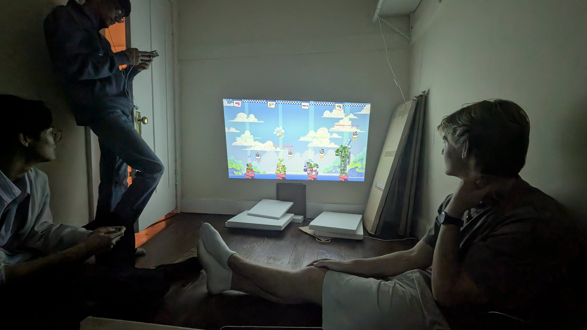{hole}
Later, Paolo pulled out his Nintendo Switch, and we played Mario Kart and some wild tower-stacking game. Laughter, yelling, and close finishes everywhere.

# Cards from Home
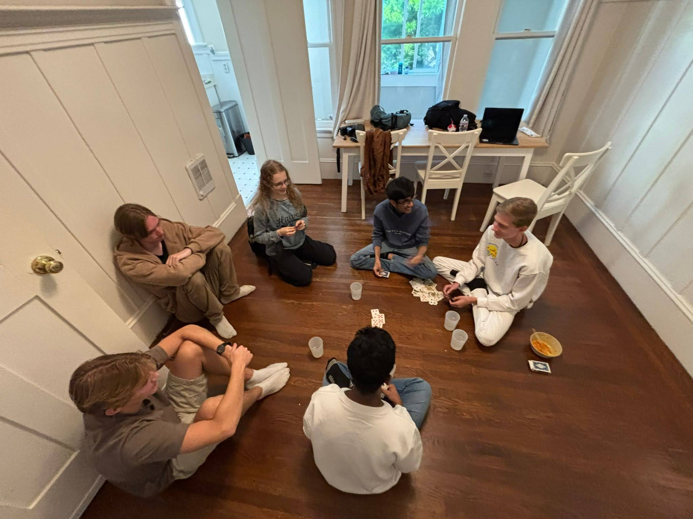{hole}
I brought out a special deck of playing cards from my grandparents.
We played some chill games on the floor with music in the background. A small moment, but it felt really nice.
Here’s a polished, more readable version of your **Day 4 6/19** entry, keeping it casual and fun for your family:

### Day 4 6/19
{right}
## Golden Gate Bridge Adventure
For most of the day, not much really happened. But around 6pm, things picked up, we all headed out to visit the Golden Gate Bridge.

Our group of 8 was the first to arrive, so we walked partway across the bridge while waiting for the others. Eventually, about 14 of us were there.

At one point, I realized I was unintentionally leading the group. just walking ahead with no idea where I was going. So, naturally, I picked a random path… and somehow ended up at a pier.

We joked that it felt like we were in a *Lemmings* game, everyone just blindly following along!

Along the way, I talked with a few people and ended up having a blast hanging out with **Elliott** and **Om**. super chill and hilarious guys. Definitely a highlight of the day.

# frozen pizza
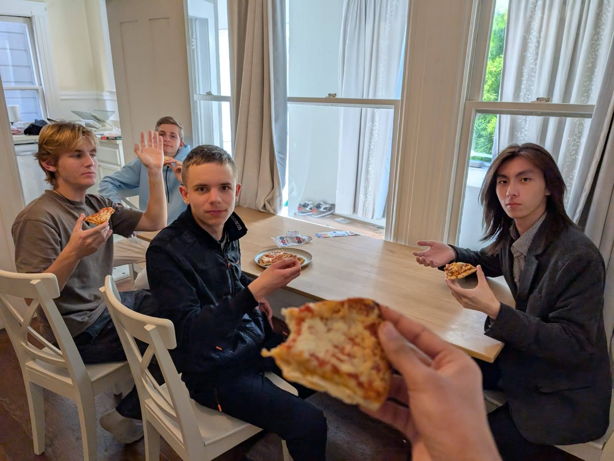{right}
All of us did not feel like cooking and wanded something simple before going to the bridge. So, WE GOT **PIZZAS**! 6 of them actualy. but only some of the group wanted pizzas and so we had like half a pizza left and did not use 2 other pizzas. 
So we have more leftovers for another day!

### Day 5. ٩(ˊᗜˋ )و
## I dind't do anything interesting today

### Day 6 6/21
{right}

## City Adventure!
The day started with my usual morning walk, and then we decided to head to Market Street to find a good spot to work on our 40 programming hours.

We tried multiple locations, but since it was Saturday, most places were closed. except **Salesforce Park**. It's this elevated park surrounded by Salesforce buildings, with a cable car leading up and even a small band playing country music. We hung out there for a bit and enjoyed the vibe before continuing our search.

## .
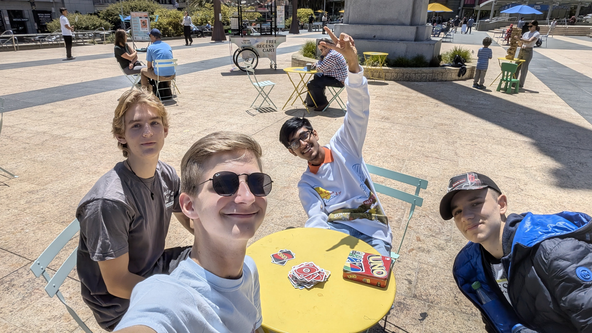{left nobottommargin disapearat500px}

## Apple Vision Pro Experience
{right bigasmain}

On our walk, we stumbled across a couple of cool stores. one of the only Nintendo locations in the area, and of course, an Apple Store.

Inside, we saw the **Apple Vision Pro** on display and noticed they had open booking slots… in just one hour. So we killed some time in Chinatown, grabbed ice cream, and played a game of UNO in the sun. Then it was time to try Apple’s $3,500 goggles.

## My Honest Review:

1) I honestly can’t think of anyone who’d *really* benefit from owning one in day-to-day life.
2) Gaming? Not great. The only thing I managed to play was **3D solitaire**.
3) I tried opening Excel and it felt clunky. not ideal for real work.
4) **BUT** the eye tracking? Super slick. Your eyes act like a mouse, and you can “pinch” your fingers anywhere to click. It felt smart and surprisingly smooth.

Will I go back to play with it again? Absolutely. You can book as many sessions as you want, and I definitely will.

## Midnight Programming
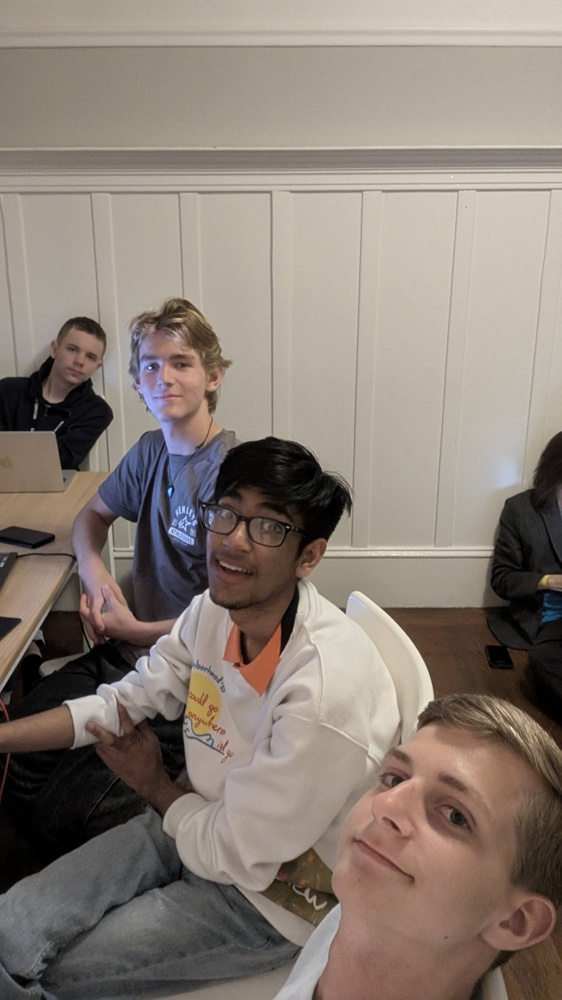{left vertical}

Since most of us were *nowhere near* the 40-hour mark, we all ended up staying up way past midnight trying to catch up. Around 2am, I finally called it quits.

I spent most of that time working on my multiplayer escape room game. where you solve puzzles with friends online. and chatting with others until I realized how late it was.

Final count for me this week? **18 hours** of “programming.” Out of the goal of 40.
Do I feel like I’m getting kicked out?
Not really…
But I guess we’ll find out soon. **(• - •)ゝ**

### Day 7 6/22
{right}

## Sunday Vibes & Burritos
We woke up around 9am and went on our usual mini morning walk (ᵔ◡ᵔ)
Not long after, we got a message from Thomas:

> **"Meet at 12pm in Dolores Park to kick off the new week and eat burritos!"**

Sounded like a perfect plan.
Before heading out, I had a super encouraging call with my mom and brother about my new game idea. a 2D online escape room with physics. It really got me hyped to build something fun!

When we arrived at Dolores Park, all the Hack Club houses had gathered. about **36 people** in total! We lounged in the sun, chatted, and devoured some *chicken burritos*
Eventually, about half of us decided to head to the open workspace downtown to get some hours in.

## Battery Crisis
{left}
Once we got there… we realized something.
**None of the Europeans brought their power adapters.**
So while we all set up our laptops, they started dying. One by one. Slowly. Tragically.
Before long, all our batteries were dead and we had to head home to grab our adapters.

When we finally returned, the workspace was already closing. it shuts at 6pm. So we had to pivot.
## Hotel Coding Session
We wandered around and ended up finding a random hotel with a comfy lobby where we could sit and code (´｡• ᵕ •｡`)

Honestly? It was kind of perfect.

There, I clocked **8.4 hours** of focused programming. working more on my online escape room game. Felt good to finally make solid progress toward my weekly goal.

While coding, I even got a surprise video call from none other than **Paperclip**! (╯✧▽✧)╯
We chatted for a bit… about nothing particularly important, but it was still a fun little moment to wrap up a weird, wandering, productive day.
### Day 8 Time Flies
{left}
## Wait… it’s already Day 8?!

Today it hit me. **I’ve already been here for 8 days**. Time is flying way too fast!
We decided to start planning a few things since it’s the **last week for Om** (*nooo*). So we made two awesome plans:

1. Apply for an event about **ComfyUI** at **GitHub HQ**
2. Plan a visit to **Paperclip**, who’s nearby this week!

which I’m super excited for! (≧◡≦)/

## Back to LinkedIn HQ
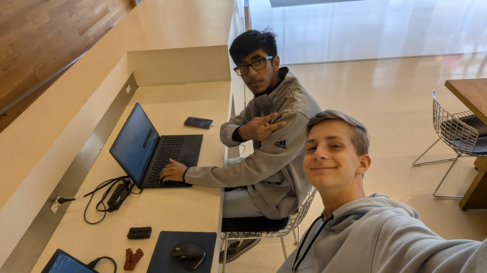{right}
In the morning, Om and I headed straight to **LinkedIn HQ** to get in some serious programming time. A bit later, **Elliott** joined us too.
We ended up staying there for **5 full hours** of coding! That brings my total to...

**12 HOURS!!** ヽ(・∀・)ﾉ

I’m currently **#2 on the leaderboard**, with the top person already at 23 hours
Still, I’ve got a solid lead on #3, so I’m feeling good about where I’m at!

## Grilled Cheese Break & More Coding
After our LinkedIn coding session, we went back home for a quick grilled cheese recharge
Then. back out again to the open workspace to put in even more hours. Gotta keep the momentum going!

# Yes i know there is no day 9,
Becouse there is nothing fun to talk about. We still have to make 40 hours you know?!

Absolutely! Here's a polished and fun version of your **Day 10 GitHub HQ!!!** entry, with Kaomojis, cleaned-up grammar, and a little extra structure to make it more exciting and family-friendly:

### Day 10 GITHUB HQ!!!
{hole githubhq}

## HOW?!
Today we got to attend an event hosted by **ComfyUI**. and it just so happened to take place at **GitHub HQ**.
Yes. *GitHub.*
Still can’t believe that sentence is real.

ComfyUI, for context, is a visual node-based AI image tool. kind of like drag-and-drop Photoshop powered by AI. The event was part hackathon, part hangout, and part surreal tech dream.

## What Even Was It?
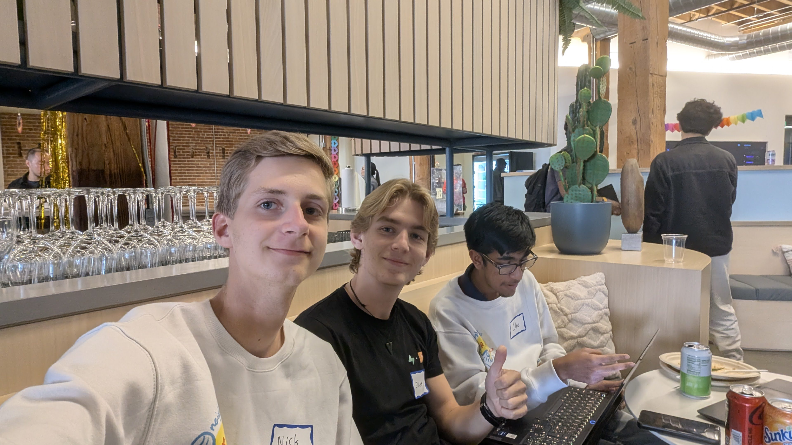{right hole}
It was a mini hackathon where we had to build a **workflow** using ComfyUI.
Our group made a simple background blur effect, using depth mapping and image processing. Was it revolutionary? Not really. But did it work? *Yes.*

The prizes?
**2x RTX 5090 GPUs** and Some cool T-shirts ...which we didn’t win
But hey, it was still a ton of fun.

## Inside GitHub HQ
From the outside, GitHub HQ just looks like a regular grey building with a tiny sticker on the door that says “GitHub.” Kinda underwhelming, right?
But once we walked in… WHOA.

The place was packed with small, geeky details.
One of my favorites? The **security guard’s vest** had “SSH” written on the back. like the secure shell protocol. Little Easter eggs like that were everywhere. The whole venue had serious personality.

Definitely one of the coolest tech spaces I’ve ever been in!
# Wait… What Is GitHub?
For those reading who don’t know:
**GitHub** is a huge tech company used by developers around the world to share code, collaborate on software, and build projects together.
Think of it like a giant library of code that people from everywhere can access, improve, and remix. It’s *the* place to be if you build things with code.

### Day 12 Talk with Thomas!
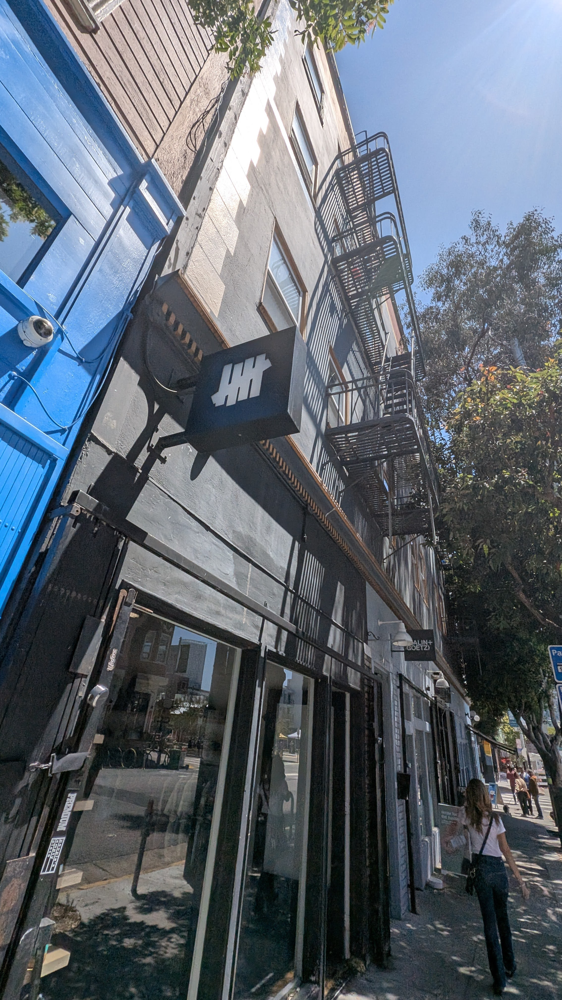{right vertical}

## A Chat with Thomas
The day before, we noticed a few things that felt off. like how San Francisco is this city full of events and energy, but the **40-hour system** kind of discourages going out and exploring. Also, things like research or design work didn’t count toward the time tracker, which felt limiting.

So me, **Elliott**, and **Om** put together a list of points and asked Thomas if we could talk. As soon as we brought up our concerns, he smiled and said,

> “Let me show you something I’ve been cooking up…”

## 🦅 FREEDOM WEEK 🇺🇸
Thomas announced an upcoming experiment called **Freedom Week**, 
starting **Monday, June 30st July 6th**

No hour tracking, No 40 hours. Start a **brand new project** from scratch and make a **5+ minute YouTube video**

It’s totally optional. but of course I’m doing it.
**Let’s goooo!! (ง🔥Д🔥)ง**

## Other Stuff We Talked About
We also talked about

> Juice merch (coming… eventually)
> Buying furniture for the house
If you're a Juice person and curious about merch updates. DM me on Slack! but dont be hyped

## The Interview
{left}
Later that day, we headed over to the **Atrium on 2nd Street**, and got a surprise call from **Paolo**.

He wanted to film a quick interview with us before Om leaves Neighborhood. It went pretty well!
Another memory locked in.

### Day 13 Poker & People
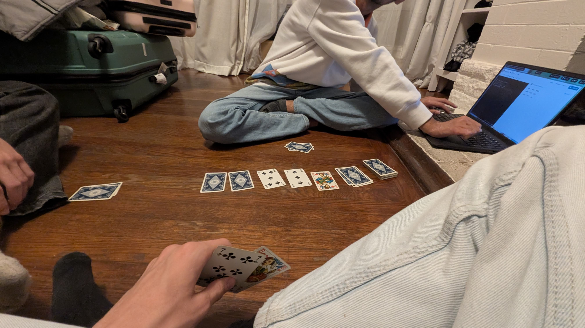{right}

## Poker Night!

I brought a deck of cards from back home and decided to play some games with **Om**. we played **Swedish Bullying** and good old **Texas Hold'em**.

Not gonna lie… Om may have turned me into a bit of a gambling addict (*in the fun way*, I promise)
I *loved* the strategy, the bluffing, the chaos. 
Aond… **I won a whole bunch!**

## New Faces, Temporary Chaos
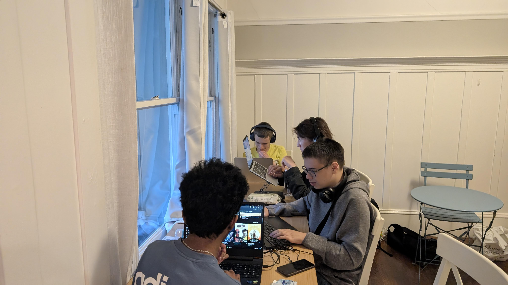{left}

Some new people arrived in SF today, but they didn’t have a place to stay just yet. so they crashed at our house for one night.

Let’s just say… it was **really** busy.
Loud, packed, and kind of fun in a chaotic way.

## Ship Sunday
Today maked the end of the week and we has to show what we made that day.

### Day 14 The Birth of *Pao*
## Idea Storm

Today was a **full-on brainstorming marathon**. I woke up at 10am and went to bed around 2am. with a working prototype and a chaotic, hilarious idea for a game.
And honestly? It’s *super fun to play* already!

The idea? A game you play with friends where you have to **eliminate your target by secretly taking a selfie with them** in the background.
Simple, sneaky, and *a little evil*

## Introducing: **Pao**
> A real-life game of betrayal… with selfies.
> *It’s like Among Us, but in the real world.*

You get a secret target, sneak a selfie with them in frame, and **boom. they’re out.**
You take their target. Game continues.
Last one standing is crowned **The Pao Champion™**

You can read the full README [right here](https://github.com/AleksanderGPL/pao), 

here’s the TL;DR:
# Pao in 3 Sentences:
> It’s a real-world, multiplayer game of stealth selfies.
> You eliminate your target by snapping a picture with them in the background.
> It’s funny, sneaky, chaotic. and you’ll never trust your friends again.

### Day 15 Just Paolo Being Smart
{hole}
A quiet day overall, but I caught Paolo doing something incredibly smart and totally in-the-zone.
That’s it. That’s the post. (✿´‿\`)

### Day 16 Noicebridge Vibes
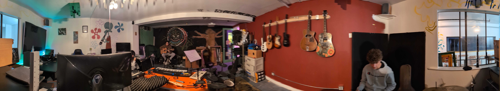{hole}

## We Went to Noicebridge
{dontautostart hole}

**Noicebridge** is one of San Francisco’s most iconic hackerspaces. It's a big, open community workshop where anyone can build, tinker, code, 3D print, paint, sew. you name it.

The whole space is run by volunteers and totally open to the public. The vibe? Super creative and weird in the best way possible. (｡•̀ᴗ-)✧
While there, Paolo even played a bit of guitar 🎸

## *Pao* Lives On
{dontautostart left}
We’re still working on **Pao**. testing it with friends, laughing a ton, and fine-tuning the chaos.
So far: lots of eliminations, sneaky selfies, and betrayal. Perfect.

### Day 17 Chair-Carrying Chaos
{left}

## We Carried 5 Chairs + a Big Table… Through SF
{left}
Yes. We really carried 5 chairs *and* a table across San Francisco. including on the metro.
Why? Because Hack Club housing is DIY to the core.

## More Pao Testing
{dontautostart left}
More eliminations. More laughter. More paranoia.
**Pao is life.**

### Day 18 🇺🇸 Fourth of July
{hole}

## So Many People
{hole}

## Coolest Things We Saw
{hole}
There was a guy doing flips *over* another Hack Clubber.
The fireworks, crowds, and chaos made for one unforgettable night.

### Day 19 Chill Mode
## Walk in the Park
{horizantal left}

## Starbucks Stop
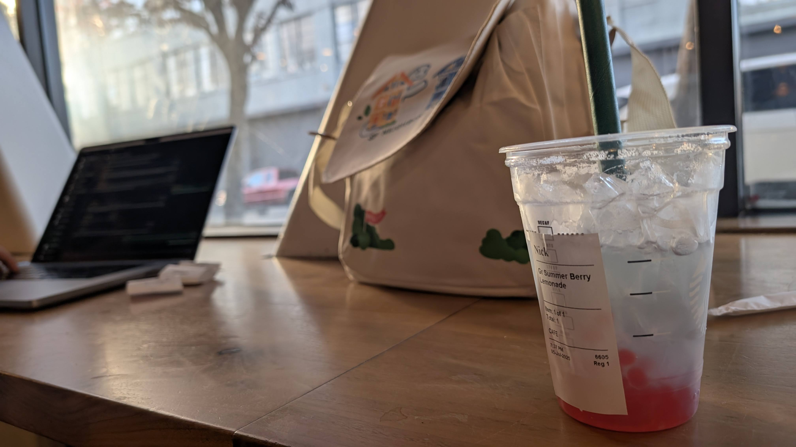{horizantal left}
Not every day is loud and crazy. This one was just nice, quiet, and full of coffee and trees. 
(▰˘︹˘▰)

### Day 20 Grinding & Cleaning
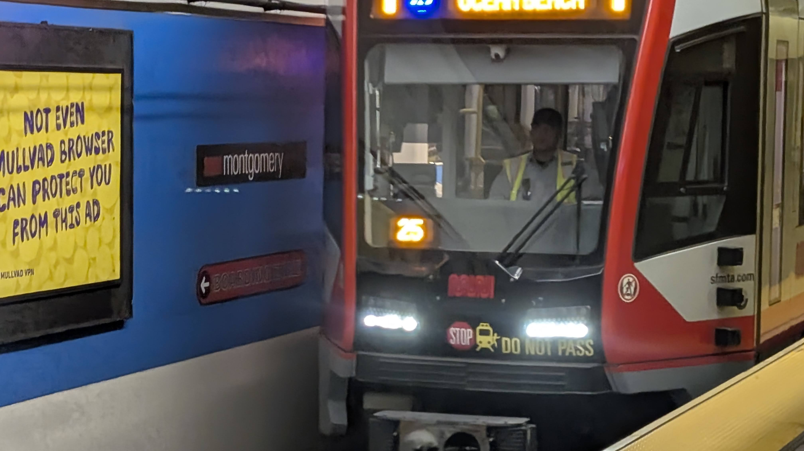{horizantal left}

## Late-Night Coding
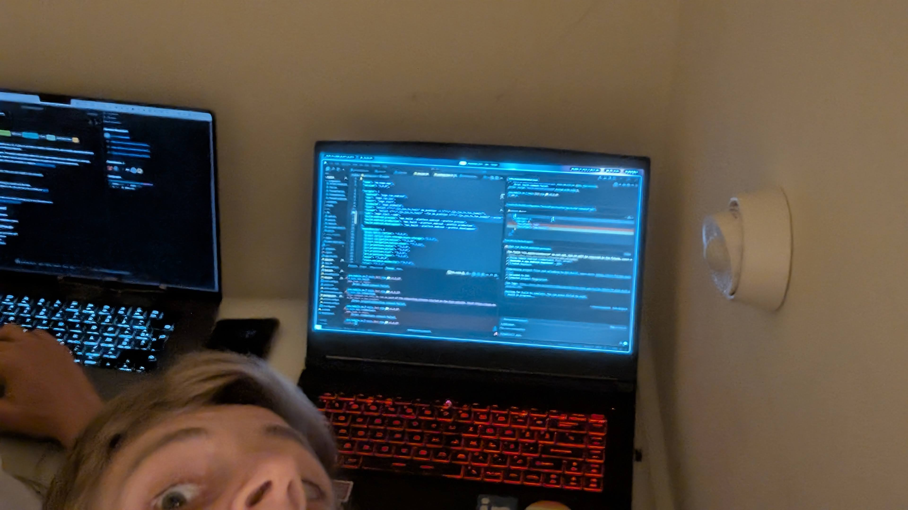{horizantal left}
Sorry for all the photo/video-only updates. I honestly didn’t feel like writing this week. But trust me. we’ve been coding, building, and shipping. Late nights, good snacks, and progress.

### Day 20 (continued) **Cleaning Day From Hell**
## When You’re the Only One Who Cares
Someone clogged the toilet *and* left without saying anything. Another person? Clogged the shower.
No one cleaned. No one even said sorry.
So yeah. I cleaned both.

## 16 Minutes of Toilet Hell
{horizantal left}
I woke up to **Alexander screaming at me** next to my bed:

> “You’re the leader of the house. you clean the toilet.”
> 🤬

He loves arguing and never listens to others. I already disliked him, but now\... I *really* dislike him.

I wouldn’t mind doing the cleaning if people actually appreciated it. but with him? All the “thank you”s feel hollow.

## The Shower Saga
{right}
The shower was clogged so badly that I had to call a plumber. Turns out: someone’s hair had blocked the whole thing.
We paid up front (don’t worry. the landlord reimbursed us), but after the plumber left, the shower was *disgusting.*
So I scrubbed it for nearly an hour to make it usable again.

## Final Thoughts
People in Neighborhood don’t clean up after themselves nearly enough.
It’s gross.
And I’m tired. (￣ヘ￣;)

### Day 21 Game Making 7/7
## Game Dev with Kai Ling
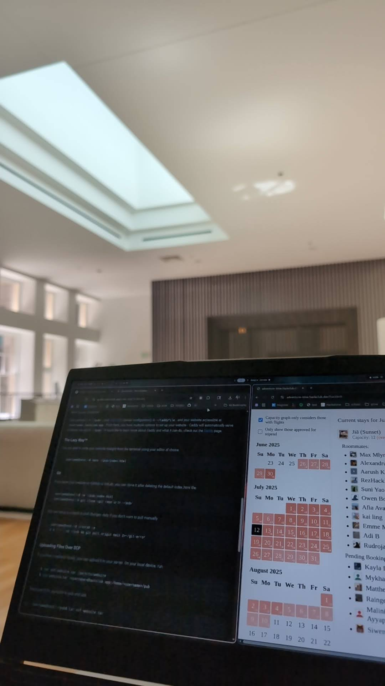{right vertical}
Yesterday, **Kai Ling** made an announcement:

> "Come to 55 2nd Street to follow a Godot game-making course. 
From 10am to 6pm. lunch and dinner included!"
Of course I went!

I’ve been making games since I was 9 years old. mostly in Unity. building everything from **Mario Party knockoffs** to **multiplayer VR experiments**. But since starting college, I haven’t had much time to work on my passion.

So between **Juice last April** and this week in San Francisco, I’ve finally found space to reconnect with game design.

And honestly? I love it so much.
It feels like coming home.

## Dinner & Dancing
{left}
After a solid **8 hours of straight programming**, we headed to a nearby park to wind down and enjoy some well-earned dinner.

The weather was perfect, the food hit just right, and the vibe was pure chill. Then we noticed a group nearby dancing. and of course, **me, Elliott, and Johan** jumped in and joined them for one dance.

A perfect way to end a long, productive day.

### Day 22 7/8
## Paolo
{right}
I went back to the Atrium today to keep working on my game, but I didn’t get far before getting completely distracted by the new ping pong table. Classic.

## Game Progress
I still managed to put in some time on my project. You can check it out [here](https://nick.hackclub.app/canopy/build/).
It’s a "simple" tower defense game where you play as an old man living on an island, defending your home from waves of bats and birds with the help of programmable bots.

## Gameplay
{left dontautostart}
The prototype is shaping up nicely, and it’s already fun to play.

### Day 23 7/9
## CRP
Today started quietly. I was one of the first to wake up and went on my usual morning walk. When I got back, things had turned chaotic.

We found out that Child Protective Services had been called on one of the other Hack Club houses. Panic broke out. Almost everyone at our house fled, except me and Alice. One guy even packed everything and left for home.

After about an hour, the situation calmed. Police had visited the other house, but according to Thomas, they were simply checking in due to how unusual this kind of student hackerspace looked. They talked with students and parents and left peacefully.

## It’s Over
Later that evening, Thomas made an announcement:
"With everything that has happened lately, the police being called was the final straw. I’ve made the difficult decision to end Neighborhood."

Just like that, the program was over. People felt confused, heartbroken, even angry. The announcement hit hard.

Everyone was asked to book their return flights by July 18. Thomas said he would help with bookings starting the next day.

## Thomas
{left dontautostart}
Watching him deliver the message in person felt surreal. This community changed a lot of people’s lives. including mine.

### Day 24 A Small Comeback 7/10
## I Can Stay?
The next morning, Thomas made another announcement. He said twelve people would be allowed to stay. He dropped a form, and the selection would be based on grant weight and impact.

I signed up right away.

So did Asker, a thoughtful and enthusiastic person
Elliott, someone I really respect and look up to
And Alice, one of the kindest, most grounded people I’ve ever met

## I Got In
That night, I was added to a group chat with 18 others.
Elliott and Asker were in.
But Alice wasn’t.

I kept refreshing, hoping she’d appear. But she didn’t.
It hurt more than I expected.

I didn’t want to say something rash to Thomas in the moment, but I did write him a message. Just to be honest.

# Dear Thomas
{right}
*Sent at 1:22 AM, July 11, 2025*

I'm in kind of a pickle.
I only want to stay if I know I’ll really be happy here.

Oscar wants to move to Lower Haight. Elliott is still deciding between Orlando and here.
But what’s hitting me hardest is Alice not getting selected.

I genuinely believe she is more mature and emotionally grounded than anyone else in the program. including me.

Over the past few nights, we’ve grown close. She’s been a calming presence during all this chaos. I don’t think I can do this program without her.

I also don’t think it’s too late to reconsider.
Four people in Lower Haight won’t feel like a community. Six or seven would.

And with her parents not being home right now, she might not even have a stable place to return to. She’s also one of the original organizers.

She deserves this more than I do.

I’d love to hear your side of things and maybe help however I can.
I’m going to bed now, and I’ll see how I feel in the morning.

Best,
Nick

# Tomorrow Is Undercity
Tomorrow is Undercity, another Hack Club event. It’s a multi-day hackathon held at GitHub HQ.

It’s probably where I’ll say goodbye to a lot of people.
It feels like the right place to end this chapter.

### Day 1 of Undercity
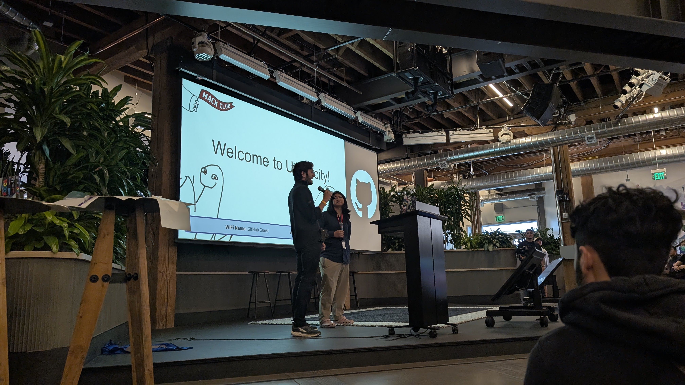{right}

## Good Morning

I set my alarm for 9am… and of course I slept right through it. Woke up late with barely enough time to get ready. Thomas was at the house booking flights home for everyone, and after helping a bit, I grabbed my stuff and headed out to **Undercity**.

Took the metro, walked a bit, and then suddenly I was here. surrounded by nearly **200 other hackers** ready to build and ship.

## What Is Undercity?
**Undercity** is a multi-day hardware-focused hackathon hosted at GitHub HQ, run by Hack Club. It’s the latest event under the umbrella of **Highway**, a summer program supporting students in building ambitious, creative projects.

Undercity is intense, inspiring, and packed with projects. Think:

* Hackers sleeping on the floor
* Real deadlines
* Free meals
* Hardware chaos
* Plushie prizes
* And more unforgettable moments than you can count

## I Met Paperclip
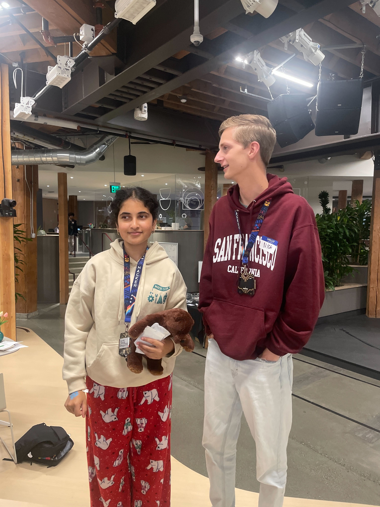{right vertical}

At the start of the event, **Paperclip** announced:

> "The first person to tag me with a paperclip gets something."

Naturally, I came prepared. with **two boxes** of paperclips, over 300 total. I handed them out to everyone just because I found it funny.

Meeting Paperclip for the first time was awesome. She’s small, full of energy, and incredibly welcoming. She ran around saying hi to everyone, instantly lifting the vibe of the entire room.

## Starting Presentation
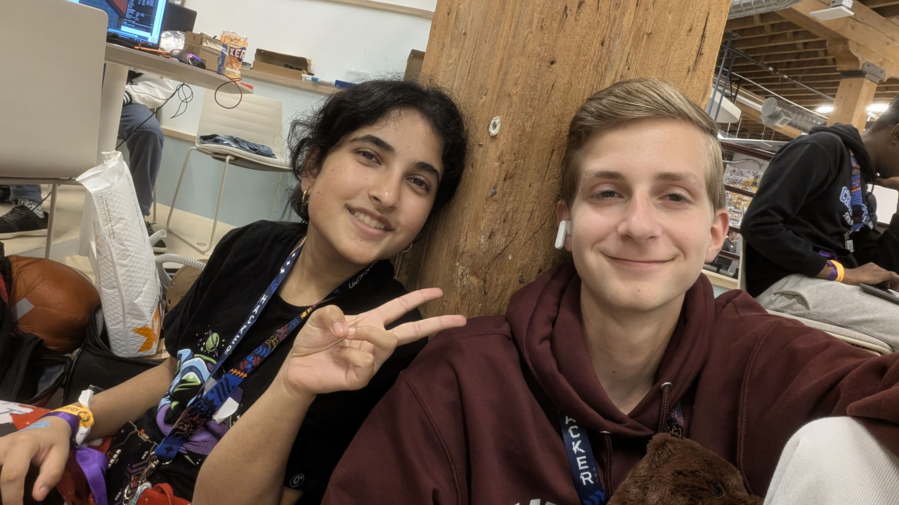{left horizantal}

The opening presentation set the tone for everything to come:

* Build a hardware project
* Top 10 get plushies
* First place gets a **3D printer**
* Second and third place get secret prizes

I didn’t officially join a team. I just wanted to enjoy the experience and get away from what Neighborhood had become. I loosely teamed with **SPC**, but mostly I floated and had fun. And honestly? That worked out really well.

# The Rest of Day 1
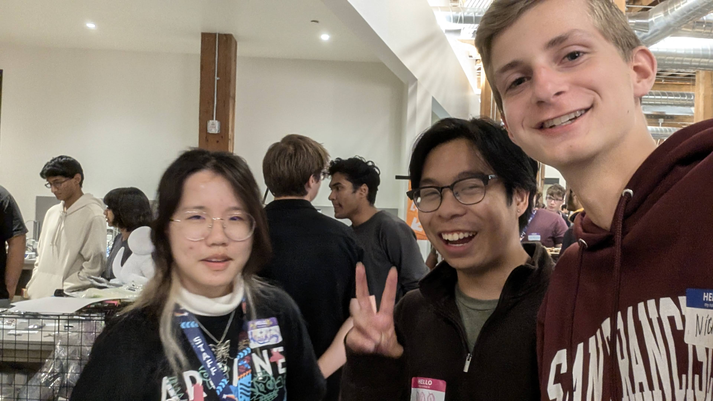{right}

The rest of the day I mostly spent with Paperclip. helping with badges, talking with people, just having a great time.

### Day 2 of Undercity
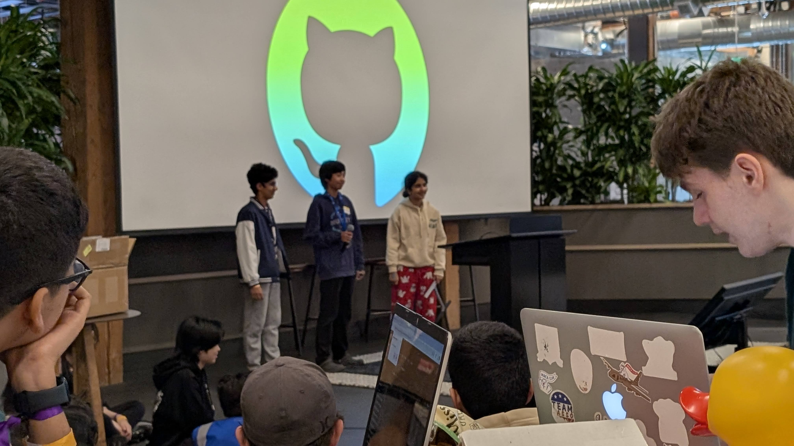{right}

## Morning Vibes
Despite sleeping on the floor, I had a surprisingly great night's sleep. My hip hurt a bit from laying on my side, but it was still a good night.
Right after waking up, the demos started. Paperclip’s team (Evan & Samith) built a working **chocolate 3D printer**. Yes, really. Chocolate. It was incredible to see it working.

## Refresh and Reset
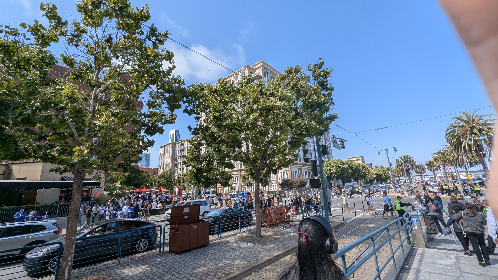{left}

I quickly went back home to shower, shave, and generally not feel like a mess. On my way back to GitHub HQ, I walked past a Dodgers vs. San Francisco Giants game.

It was cool to see that part of American sports culture up close. My grandfather would’ve loved this moment.
Ik hou van je, opa.

### Day 3 of Undercity
## Time Flies
These Days all just went to fast, and with a blink of an eye. its already day 3

## I Had Lunch with Paperclip and John Cohn
I met [John Cohn](https://en.wikipedia.org/wiki/John_Cohn) without realizing who he was. We grabbed Chipotle together. me, him, and Paperclip. and had some amazing conversations.

He gave me a [Sam Stone](http://samstones.org/WordPress1/?page_id=37), a tradition he’s known for, and shared personal stories full of meaning.

John is the kind of person everyone deserves to meet at least once. Sadly, he was leaving the next day to set up a massive light show. I’ll miss him.

## Rooftop Views
{hole}
After lunch, we headed to the rooftop of GitHub HQ. Beautiful views, deep conversations, and that surreal feeling of being somewhere really special.

## Zach
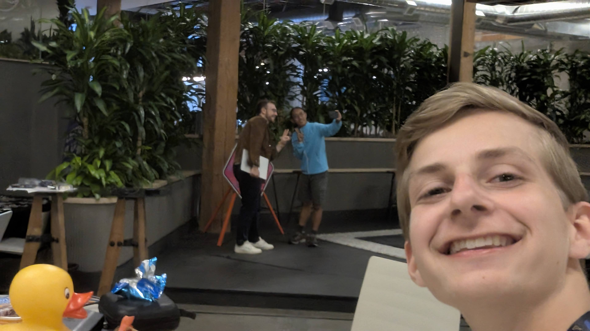{right}
[Zach Latta](https://zachlatta.com/) is the founder of Hack Club. and easily one of the most inspiring people I’ve met.

He started Hack Club because he wanted teenagers to feel like they could build real things. Not school projects. Not assignments. But things that *matter*.

Talking to him in person reminded me that this whole thing. Undercity, Neighborhood, even Juice last year. exists because he believed kids like me could do more than just sit in a classroom.

He listens, he encourages, and he genuinely cares.

This week has been chaotic, emotional, beautiful. and somehow, it all still feels like just the beginning.

### Last Day of Undercity. Day 4
## Final Demos
Today was the big one. The final demos.

The room was buzzing with energy. everyone setting up their projects, helping each other troubleshoot last-minute bugs, and rushing to finish details. Despite the chaos, it was beautiful.

There were so many cool things to see:
A glove that controlled a computer.
A glowing LED cube running a game of Snake.
And the winner? A **toilet paper folder**. Yes. That won first place. And honestly? It deserved it.

After the demos and voting, we had one last group presentation, followed by the awards. People clapped, laughed, celebrated their work. 
Paperclip's team eventily got into the top 10

And then… it was over.

We cleaned up the space, packed our bags, and stood around in small circles, not quite ready to say goodbye.

## Goodbye
The last few days have been *unmatchable*.
Not just fun. but something deeper.

This week has been the **best time I’ve ever had**. By far.

I didn’t expect that. I came here after the chaos of Neighborhood, just hoping for a soft landing. What I found was something close to magic.

Spending time with these people, building, laughing, dancing, sitting on the floor writing code at 1am... it felt like I belonged in a way I haven’t felt in a long time.

And Paperclip. she made it all even more special. Her energy, her joy, her way of making everyone feel seen.

It hurts to let go of this.
But I know I’ll carry it with me.
The people. The memories. The feeling of building something that matters.

Thank you, Undercity.
You changed me.

Here’s your final entry—**Het Einde**—edited and shaped into a fitting, emotional closing message for your blog. It wraps everything up with clarity, warmth, and your voice preserved:

### Het Einde — 7/17
## And just like that, it’s over
Thomas announced that **Post-Neighborhood** is being canceled too. The landlord decided to evict us, and we all had to leave the house just two days after hearing the news.

So now I’m here, writing this last entry **from home**.
Waiting for Hack Club to announce whatever comes next.

This was my first time writing a blog.
The first time I really shared something like this. raw, unfiltered, personal.

If you’ve made it this far, through **739 lines** of stories, chaos, joy, frustration, and everything in between.
Please, send me a quick DM, an email, anything. Just let me know:

**Why did you read this?**
Was it the writing?
Was it curiosity about what Neighborhood was like?
Were you looking for inspiration to join something like this someday?
Were you hoping to meet me?
Or maybe, *just because.*

Whatever your reason
**Thank you.**
Truly.

This time in San Francisco was chaotic and life-changing and full of unexpected beauty.
And I’m so, so grateful to have lived it.

– Nick Esselman