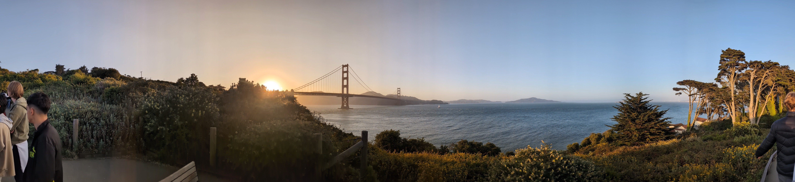

### Day -8, The Days Leading Up to SF 6/10
{hole}
## Almost There!

I’m typing this while racing to hit 100 hours of work on my website project-only 20 minutes to go! Once I cross that finish line, I’ll have exactly 16 days until my big trip to San Francisco.

## What Happened Today
When the trains went on strike today, everyone switched to online classes. Normally we’d get the day off, but apparently we’ve been too “rested” lately. So here I am-Zooming away, coffee in hand, multitasking like a champ while jotting down these notes.

### Day 1
{left}
## Before the flight
I arrived at Schiphol with my brother, mom, and dad. After a few hugs and a very real “this is it” moment at the gate, I waved goodbye and stepped into solo travel mode. Next stop: San Francisco. Alone. For real.

## My Flight,
The flight itself? Surprisingly chill. I somehow scored three seats to myself. I stretched out (kinda), watched Interstellar for the 2nd time, and vibed to music until sleep finally kicked in. Sure, it wasn’t five-star comfort, but it did the job.

## I arived!
Touchdown in San Francisco! But of course, my story couldn’t be that smooth, border control wasn’t quite sure what to make of my “I’m going to build stuff with internet nerds I met online” explanation. So they took me into a separate room for an “interview.”

After explaining Hack Club, convincing them I’m not a threat to national security, and answering a few curious questions, they gave me the green light.

I took the BART (Bay Area metro) into the city, and then walked nearly 3 miles uphill with my backpack and suitcase. Welcome to San Francisco: the city of tech dreams.

## Pizza party
When I finally got to the house, Paolo and my roommates were already heading out, to a pizza-making party at the other Hack Club house. Even though I felt like a zombie, I tagged along. We made pizzas until 11pm, and by then my body had given up on being alive.

## Attempting Sleep
Everyone else had their bed setups ready with pillows and cozy blankets. Me? I had a couch pillow from the other house and a thin airplane blanket. It was freezing in the house. I barely slept. So yeah—end of Day 0, and I’m basically running on nothing.

### Day 2
{right}
## Morning After the Storm
After that awful night of tossing and turning, I gave up trying to sleep by 6am. My body thought it was 3pm anyway. I got up, hit the toilet, and had a chill early-morning chat with one of my roommates. I ate an apple, walked to a local café, and called my mom.

I told her the truth:
“This isn’t really what I expected... I’m not sure I want to stay the full time.”
Big feelings, right from the start.

## Chat With Paolo
Later, Paolo (a organizer and housemate) sat down with me to chat about what I wanted to build here while im at San fransico.
Truth be told, I had no clue. I thought it’d be like Juice in Shanghai, but this time, there was too much freedom. No structure. No guide rails. Just… “do your thing.”
It hit me: I’ve never really lived independently, let alone worked in a self-directed way from 9 to 5. It was overwhelming, and I started questioning whether I’d made the right choice.

## 12PM & Some Normalcy
After sulking in bed for way too long, Paolo and Abby suggested we head to the Hack Club open space—a big, cozy area where everyone was coding, vibing, and doing their thing.
We grabbed lunch on the way, and honestly, I finally started to feel a little bit like myself again.

But the peace didn’t last long—
Paolo dipped early with a headache, and Abby went out for food… and just *never came back.* So now I was alone, surrounded by laptops and strangers, wondering what to do next.

Cue: spontaneous side quest.

## The Random Adventure
{right vertical}
Feeling restless, I called my brother just to check in, and my dad jumped on the call too. With my family on the line and no destination in mind, I just started walking—somewhere. Anywhere.

That “anywhere” turned out to be… **LinkedIn HQ.**
Yup. Just stumbled right into the corporate heart of networking itself.

There was a big public lounge space inside—suits and startup folks having Very Important Conversations™. And me? I walked up to the front desk like,
“Hey, got any stickers?”
A few minutes later, I walked out with some LinkedIn swag: stickers and a branded keychain lanyard. Mission accomplished.

## The Great Pillow Rescue
After wrapping up the call, I realized I had unfinished business: **Sleep.**
Last night’s setup, rock-hard couch pillow and a too-small airplane blanket—wasn’t going to cut it again.

So I went on a heroic quest to Target, hunting for something softer, warmer, and just… not awful.
It wasn’t exactly a luxury hotel haul, but it was a major upgrade. Mission: *mostly* successful.

## Grocery Chaos
{left horizantal}
Later in the day, the five of us decided to stock up on breakfast and other essentials. Easy, right?
Turns out, not so much. With five people from different cultures, everyone had totally different ideas of what to buy. After aimlessly wandering for ten minutes, we finally made a list and split up.

My task? Apples and bananas. And—no joke—we were standing right next to the fruit section.
Mission complete in under 10 seconds.

By the time we got home it was nearly 7pm, and I was starving. But I was so exhausted I just went to bed instead. Food could wait—sleep couldn’t

## Midnight Dinner
I woke up around 11pm, still tired but now super hungry. I made a PB&J sandwich—nothing fancy, just bread, peanut butter, and jelly.
That was dinner. Simple, but it did the trick.

Right as I finished, new roommates showed up. We're now 7 people in the house. It’s getting cozy!

### Day 3 – Feeling Better
{hole}

## Morning Reset
Woke up at 6am again—jet lag still doing its thing. I didn’t want to wake anyone, so I grabbed some fruit and went for a quiet walk.

I called home and said something important:
**"I'm feeling way better today."**

Yesterday was rough, but I realized I can’t wait for things to be fun—I have to make them fun.
Paolo mentioned that attending events could count as programming time if we show proof—2 hours per event. That sounded perfect. I was in.

## Target Trip, Part II
{right horizantal}
Realized I still didn’t have a towel. So, back to Target! This time with four of us, picking up towels, dish soap, plates—everything we forgot the first time.

After a much-needed shower, I wrote down yesterday’s and today’s notes. Then we went to the Hack Club workspace downtown, where I worked on my own operating system—**NickOS**—and finally got it running on my laptop.

## Thomas’s Curry Night
On my way back home, I got a DM:

> "Thomas is cooking dinner for everyone at 7pm at Lower Haight."

By the time I arrived, Thomas, Paolo, and Nick A, were cooking curry for **20 people**.
Smoke alarms went off (a lot), but people kept showing up—4, then 8, then 14… eventually over 20 crammed into the house!
It was chaos, but so much fun—and the curry? Surprisingly great.

# Game Night
{hole}
Later, Paolo pulled out his Nintendo Switch, and we played Mario Kart and some wild tower-stacking game. Laughter, yelling, and close finishes everywhere.

# Cards from Home
{hole}
I brought out a special deck of playing cards from my grandparents.
We played some chill games on the floor with music in the background. A small moment, but it felt really nice.
Here’s a polished, more readable version of your **Day 4 – 6/19** entry, keeping it casual and fun for your family:

### Day 4 – 6/19
{hole}
## Golden Gate Bridge Adventure
{right}
For most of the day, not much really happened. But around 6pm, things picked up—we all headed out to visit the Golden Gate Bridge.

Our group of 8 was the first to arrive, so we walked partway across the bridge while waiting for the others. Eventually, about 14 of us were there.

At one point, I realized I was unintentionally leading the group—just walking ahead with no idea where I was going. So, naturally, I picked a random path… and somehow ended up at a pier.

We joked that it felt like we were in a *Lemmings* game—everyone just blindly following along!

Along the way, I talked with a few people and ended up having a blast hanging out with **Elliot** and **Om**—super chill and hilarious guys. Definitely a highlight of the day.